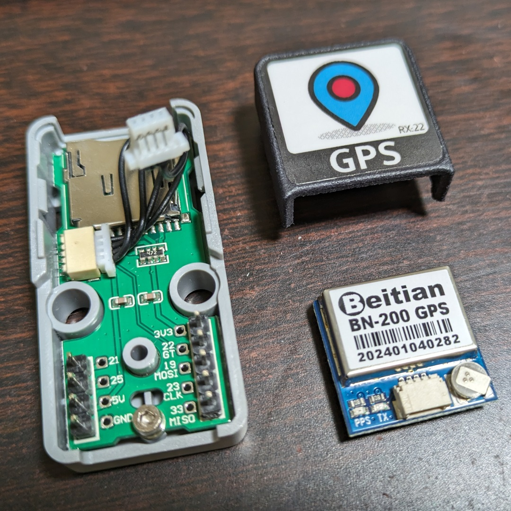
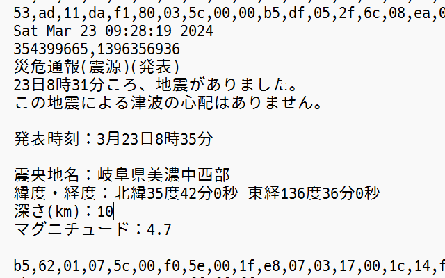

# QZSS-DCRとは

ATOMS3 + ATOMIC GPS BaseでQZSSの災危通報を受信し、災危通報の表示及びTFカードへの保存を行うスケッチです。


# ATOMIC GPS Baseの改造

ATOMIC GPS Base内蔵のGNSSモジュールは出荷時、QZSSの受信など無効になっているようです。
ATOMIC GPS Base内では、GNSSモジュールのRX端子は未接続なので分解とPCへの接続、そして設定変更が必要です。
内蔵のGNSSモジュールは「Beitian BN-200」でした。BN-200のコネクタはQwiicコネクタ(JST SH 4pin?)と形状互換があるようです。



BN-200はu-bloxのチップセットを使用しているようなので、PCからu-blox u-centerを使い設定の変更が行えます。
```
$GNTXT,01,01,02,u-blox AG - www.u-blox.com*4E
$GNTXT,01,01,02,HW UBX-M8030 00080000*60
$GNTXT,01,01,02,ROM CORE 3.01 (107888)*2B
$GNTXT,01,01,02,FWVER=SPG 3.01*46
$GNTXT,01,01,02,PROTVER=18.00*11
$GNTXT,01,01,02,GPS;GLO;GAL;BDS*77
$GNTXT,01,01,02,SBAS;IMES;QZSS*49
$GNTXT,01,01,02,GNSS OTP=GPS;GLO*37
$GNTXT,01,0FFF-FFFFFFFF-FFFFFFFF-FFFFFFFF-FFFFFFF9*52
$GNTXT,01,01,02,ANTSUPERV=AC SD PDoS SR*3E
$GNTXT,01,01,02,ANTSTATUS=DONTKNOW*2D
$GNTXT,01,01,02,PF=3FF*4B
```

以下の設定変更を行いました。
- QZSSの有効化
- UBX-NAV-PVTの有効化
- UBX-RXM-SFRBXの有効化
- UART1のボーレートを115,200bpsに変更


# ライブラリ

以下のライブラリを利用しています。
- M5Unified
- QZQSM(QZSS DC Report Service Decode Library)


# QZQSMの修正

QZQSM(QZSS DC Report Service Decode Library)は、ATOMS3開発環境下ではコンパイルエラーが発生しました。
以下の修正をして利用しています。

src/QZQSM.cpp の4484行の修正
```
uint32_t sec;
↓
time_t sec;
```


# 使い方

ATOMS3の画面をクリックするとファイルオープンとクローズをトグル操作できます。
災危通報を受信したときに画面表示とTFカードへの保存を行います。


